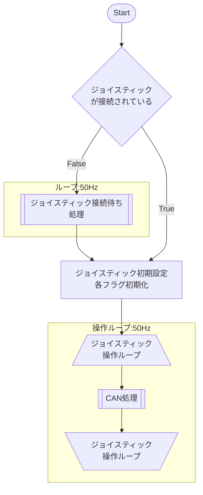
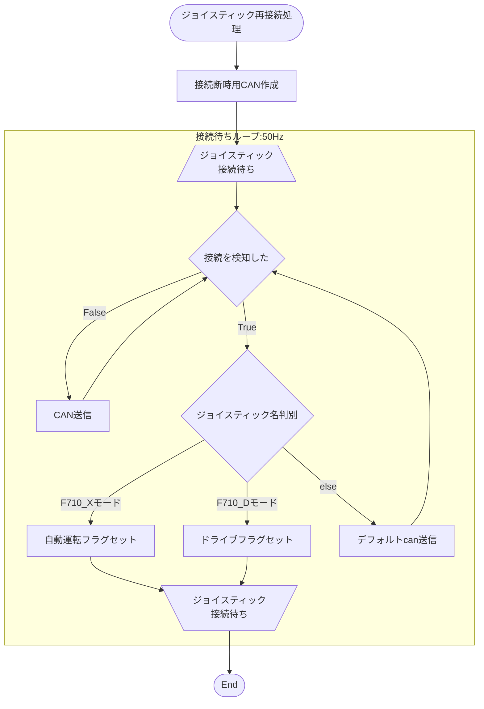
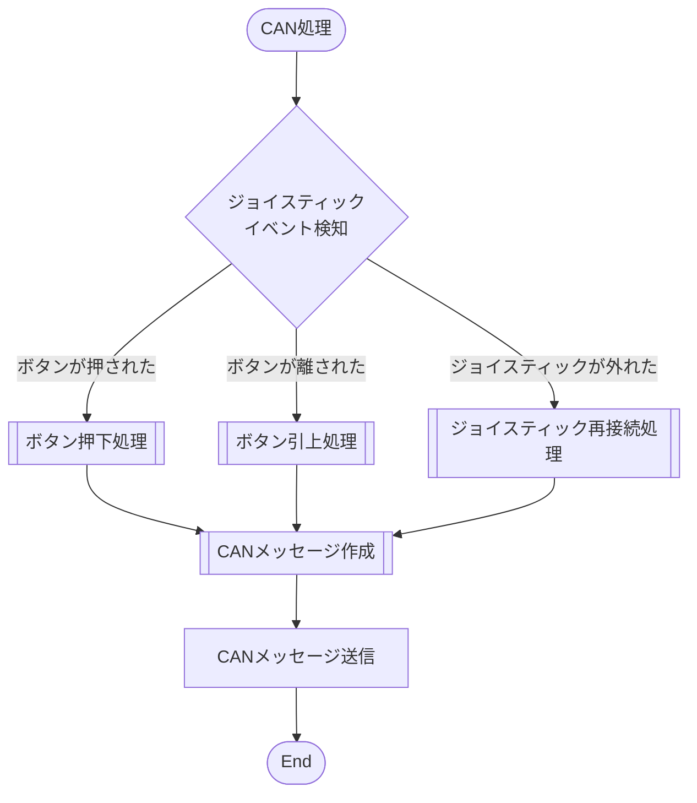
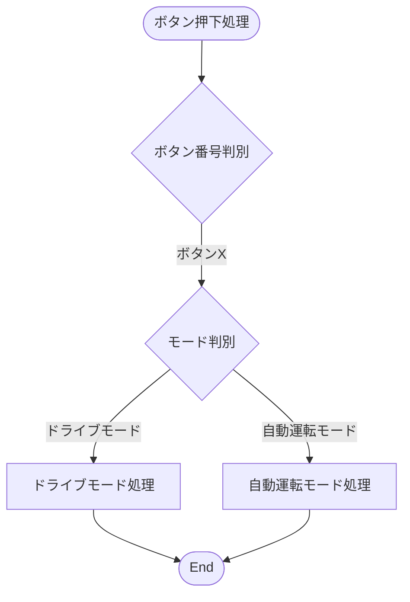
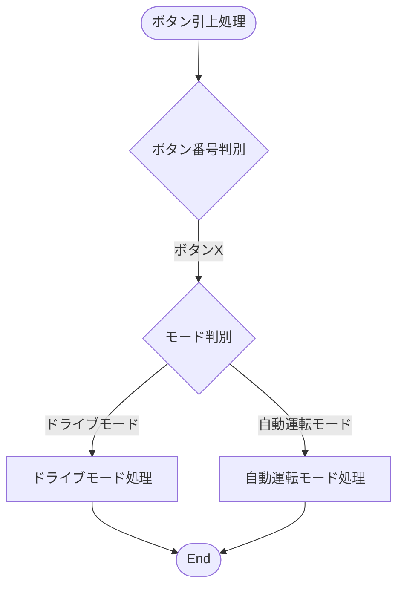
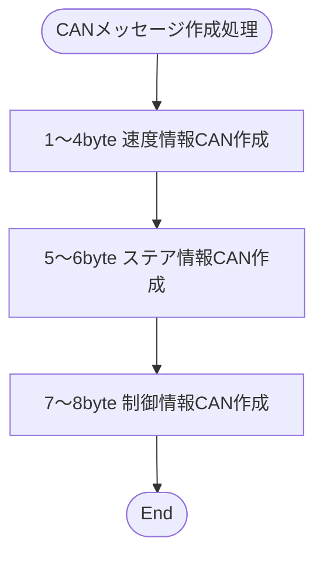

# フロー図

## 全体概要

**備考**

- 各フラグ初期化について
    - 各ボタンのデフォルト値をセット
    - can情報を初期化
    - デフォルトcanメッセージ：`00000000000085C9`
        - コントローラー未接続
        - LowSpeedモード
        - セルフドライビングモード
        - パーキングブレーキON
    
    ```python
    self.epb_flag = True
    self.emergency_stop_flag = False
    self.flontlight_flag = False
    self.autoware_mode_flag = False
    self.four_wheel_flag = True
    self.gear = 'N'
    self.stick_threshold = 50 # Ignore stick slopes below the threshold
            
    self.can_id = 283
    self.can_port = 'can0'
    self.can_bitrate = 500000
    self.can_message = '00000000000085C9'
    ```
## サブルーチン

### ジョイスティック接続待ち処理

**備考**

- 接続断時CAN作成
    - 接続断時はコントローラー接続情報を変更し、それ以外は前回のCANを再送し続ける
        - Unit2付属リモコンと同一の仕様
    - クラスが保持しているCANメッセージをもとに接続切れ情報などを付与する
    - 初回接続時はデフォルトのCANメッセージが元になるため変化なし
    - CANメッセージの編集箇所
        - アクセル情報にあたる1~4byteを0で上書き
        - ジョイスティック接続情報が含まれる15byte目を編集

### can処理

**備考**

ジョイスティックが外れた というイベントは、基本的に上部スイッチ切り替えによるF710コントローラーの再認識を指す

つまりは自動運転モード⇔ドライブモードの切り替え

### ボタン押下処理



### ボタン引上処理




### CANメッセージ作成処理



**備考**

- CAN信号（[Unit2 付属リモコンCAN仕様まとめ](https://www.notion.so/Unit2-CAN-973bcac4930b4674aae39eafc00dce5c) ）
    - 1~4byte：速度情報
    - 5~6byte：ステアリング情報
    - 7~8byte：その他制御情報
    - 信号例
        - ドライブモードで1回Aボタンを押した後、左スティックを左に最大
            - `0000000018FC854E`
        - ドライブモードで1回Bボタンを押した後、右スティックを上に最大
            - `E803000000008544`
- 速度情報作成
    - ドライブモード
        - F710の右アナログスティックの上下傾きを16bit変換
        - `E8030000` ～`0000E703`
            - スティック値をint切り捨てによる丸めを行っているため、上下で最大値が1ずれる
    - 自動運転モード
        - 常に`00000000`
- ステアリング情報作成
    - ドライブモード
        - F710の左アナログスティックの左右傾き（－1000～1000）を符号付き16bit変換
        - `18FC` ～`E703`
    - 自動運転モード
        - 常に`0000`
- 制御情報作成
    - ボタン操作によってON・OFFが切り替わる各フラグ情報を参照して信号作成
    - トルクや低速モードなどはリモコンで操作しないため固定値で信号作成
    - ドライブモード・自動運転モードで参照するフラグが異なる
        - 緊急停止フラグのみ両モード共通
        - ドライブモード
            - ギア
            - ステアリングモード
            - EPB
            - フロントライト
        - 自動運転モード
            - 運転モード
    - 以下参照箇所とCAN信号の対応表
    
    | 機能名 | 対象bit | 2進数 | 信号値説明 | 備考 |
    | --- | --- | --- | --- | --- |
    | ギア | 48・49 | 0100 0101 0100 0000 | 01:D\n 10:N
    11:R | デフォルト：N |
    | ステアリングモード | 52・53 | 0100 0101 0100 0000 | 01:Four Wheel
    10:Front Wheel  | デフォルト：FourWheel |
    | トルクモード | 55 | 0100 0101 0100 0000 | 0:Speed
    1:Torque | Torque固定 |
    | 接続状態 | 56 | 0100 0101 0100 0000 | 0:Connect
    1:Disconnect | デフォルト：Disconnect |
    | 低速モード | 57 | 0100 0101 0100 0000 | 0:Normal Speed
    1:Low Speed | LowSpeed固定 |
    | アクセルロック | 58 | 0100 0101 0100 0000 | 0:Unlock
    1:Lock | Unlock固定 |
    | 駆動系 | 59 | 0100 0101 0100 0000 | 0:4WD
    1:2WD | 4WD固定 |
    | EPB | 60 | 0100 0101 0100 0000 | 0:Break
    1:Release | デフォルト：Break |
    | フロントライト | 61 | 0100 0101 0100 0000 | 0:Headlight On
    1:Headlight Off | デフォルト：Off |
    | 緊急停止 | 62 | 0100 0101 0100 0000 | 0:Emergency Stop
    1:Normal | デフォルト：Normal |
    | 運転モード | 63 | 0100 0101 0100 0000 | 0:Remote Mode
    1:Self Driving | デフォルト：SelfDriving |


